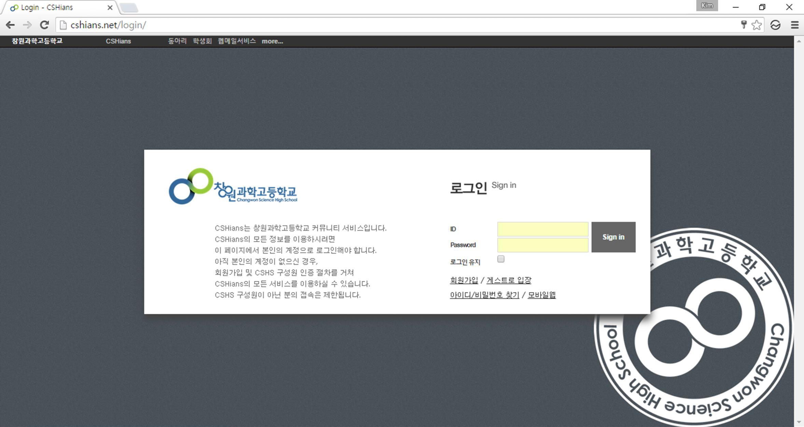
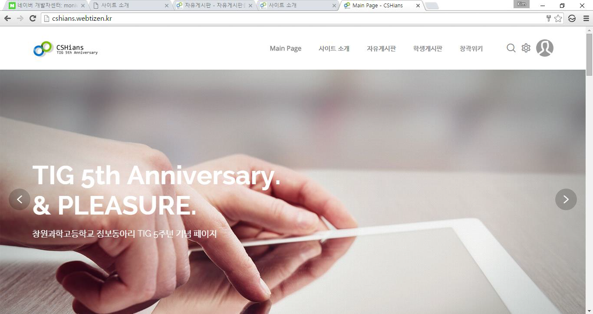
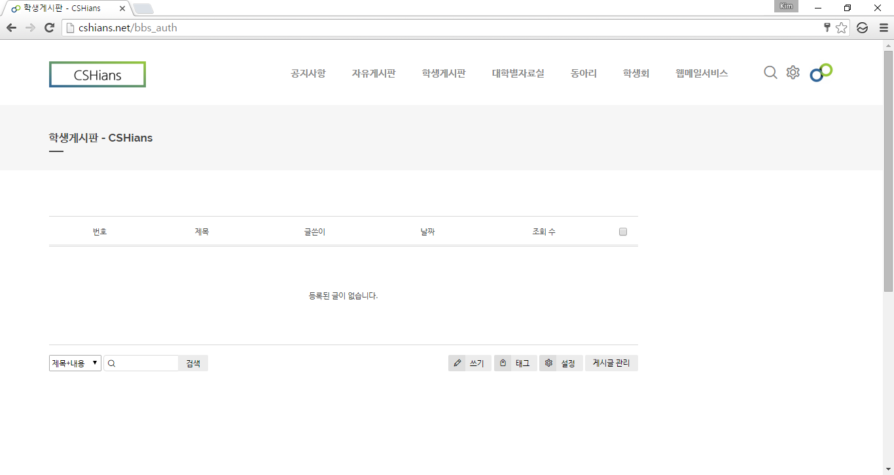
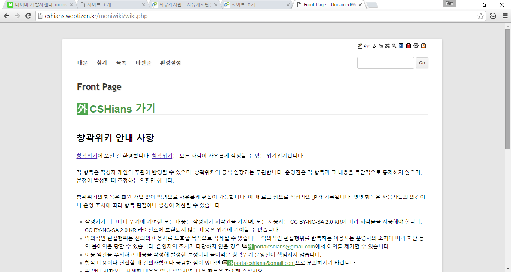

# 고등학교 교내 커뮤니티 운영

![markup-html][markup-html]
[![library-xe1][library-xe1]][library-xe1-url]
 
![participants-solo][participants-solo]
 
![group-keyeast][keyeast-image]

> XpressEngine 1.8 그리고 DokuWiki를 이용하여 창원과학고등학교 커뮤니티 CSHians를 운영했습니다.

### 스크린샷

### 개발 기간

2016년 상반기 중 8주

### 구현 사항

서비스 종료 이후 백업 과정에서 소스가 모두 유실되었습니다.

  * `유실` 웹호스팅에 XpressEngine 1.8.22 그리고 DokuWiki를 설치하고 관리
  * `유실` 공개 플러그인과 jQuery를 이용하여 커스텀 로그인 페이지를 제작
  * `업로드 준비 중` 개발 블로그 운영

### 라이선스 및 공동체 수정

이곳은 개인 프로젝트 백업을 목적으로 하는 저장소입니다.

  * 모든 제3자 사용을 허가하지 않습니다.
  * 모든 제3자 수정을 승인하지 않습니다.
    * 깃허브 Pull Request를 받지 않습니다.

<!-- Image definitions -->
[keyeast-image]: https://img.shields.io/badge/Group-Key.East-red
[markup-html]: https://img.shields.io/badge/Markup-HTML-orange
[library-xe1]: https://img.shields.io/badge/Library-XpressEngine%201.8-green
[library-xe1-url]: https://xe1.xpressengine.com
[participants-solo]: https://img.shields.io/badge/Participants-Solo%20Project-7aa3cc
